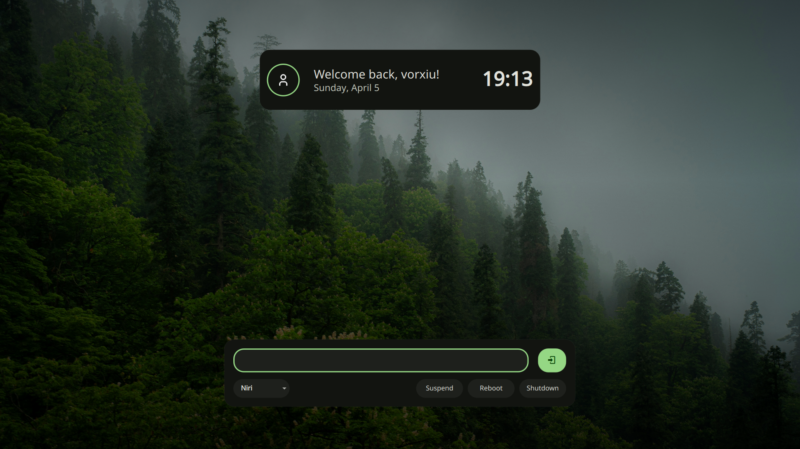

# Noctalia SDDM Theme

Noctalia SDDM is a cozy, elegant login theme for **SDDM (Simple Desktop Display Manager)**, designed to complement the **Noctalia Shell** experience.



## Features

- **Noctalia Sync** – Syncs the theme with Noctalia colors and wallpaper.
- **Responsive Scaling** – Automatically adapts to 1080p, 1440p, and 4K resolutions.

- **Smart Avatar Handling** – Automatically detects user profile pictures or gracefully falls back to defaults.
- **Session Management** – Built-in support for switching desktop sessions (Wayland/X11).

- **Customizable Configuration** – easy tweaks via `theme.conf`.

## Installation

### 1. Clone the repository

```sh
git clone sddm-noctalia https://github.com/vorxiu/sddm-noctalia.git
```

### 2. Install the theme

Move the theme folder to the SDDM themes directory:

```sh
sudo cp -r sddm-noctalia /usr/share/sddm/themes/
```

### 3. Configure SDDM

Edit your SDDM configuration file to use the new theme:

```sh
sudo nano /etc/sddm.conf
```

Add or modify the `[Theme]` section:

```ini
[Theme]
Current=sddm-noctalia
```

### 4. Restart SDDM

To apply the changes, restart the display manager:

```sh
sudo systemctl restart sddm
```

### Sync

Make the file writable by noctalia
```sh
sudo chmod 666 /usr/share/sddm/themes/sddm-noctalia/*.conf
```

Add the following noctalia wallpaper hook 
```sh
sed -i "s|^background=.*|background=$(qs -c noctalia-shell ipc call wallpaper get '')|" /usr/share/sddm/themes/sddm-noctalia/*.conf
```

Enable user templates in noctalia settings
and add to end of
  `~/.config/noctalia/user-templates.toml`
```toml
[templates.sddm-noctalia]
input_path = "/usr/share/sddm/themes/sddm-noctalia/template.conf"
output_path = "/usr/share/sddm/themes/sddm-noctalia/theme.conf
```

_Change the wallpaper atleast once to sync_

## Manual Configuration

You can customize colors, background, and blur settings in `theme.conf`:

```ini
[General]
background=Assets/background.png
blurRadius=0
radius=20
```

## TODO
- capslock,numlock and keyboard state indicators
- animations
- Some icons for Sessions

## Preview

You can test the theme without logging out by running the sddm-greeter in test mode:

```sh
sddm-greeter-qt6 --test-mode --theme /usr/share/sddm/themes/noctalia-sddm
```

_Note: If you run into "module is not installed" errors, ensure you are using `sddm-greeter-qt6` and have `qt6-5compat` and `qt6-declarative` installed._

## Credits

- All credits to mahaveergurjar for the original theme
- Designed for **Noctalia shell**

---

**Contributions are welcome!** Feel free to fork and submit pull requests.
